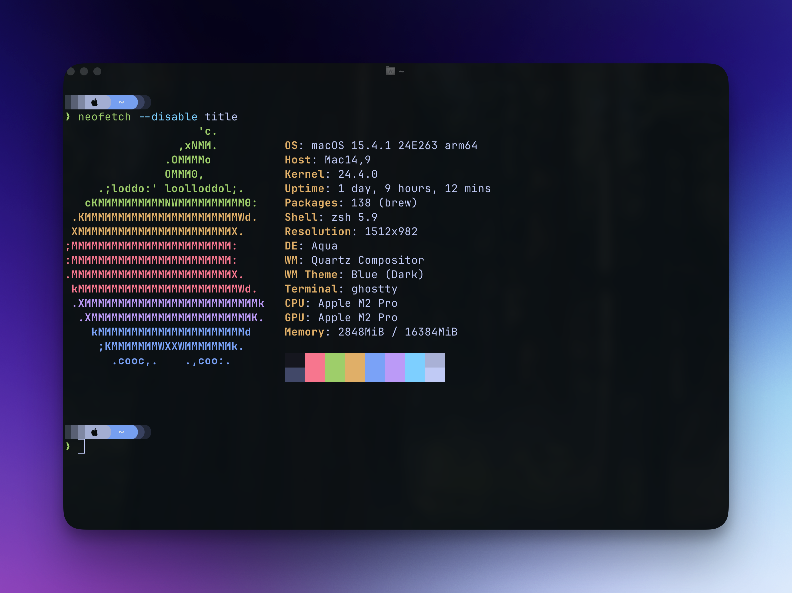

# `~/.dotfiles`

<p align="center">
  
</p>

My personal dotfiles for macOS and GitHub Codespaces environments.

## ✨ Features

- 🔄 Cross-platform setup (macOS & GitHub Codespaces)
- 🧪 GitHub Actions for automated testing
- 🔧 Easy installation with environment detection
- 🛠️ Modular configuration with GNU Stow
- 🎨 Beautiful git diffs with Delta and Rose Pine theme
- 🤖 AI-powered development tools (Claude, Gemini, OpenCode)
- 📊 Modern CLI tools (bat, eza, yazi, btop)

## 🛠️ Tools & Configurations

### 🐚 ZSH

- Custom `.zshrc` configuration
- Various useful aliases and functions
- Integration with tools like `fzf`, `ripgrep`, and more

### 🔮 Neovim

- Full-featured development environment
- LSP integration with autocompletion
- Syntax highlighting and treesitter support
- Snacks for fuzzy finding
- Custom keybindings and plugins
- AI integration with Sidekick
- Cursor like features

### 📊 Tmux

- Custom key bindings
- Status bar customization
- Session management
- Integration with tmux plugins via TPM

### 👻 Ghostty

- Modern terminal emulator configuration
- Custom color schemes and fonts
- Performance optimizations

### 🚀 Starship

- Cross-shell customizable prompt
- Git status integration
- Runtime information

### 🍺 Homebrew

- Package management for macOS
- Customized Brewfile with essential software
- Automated installation of development tools

### 🐳 Docker & Lazydocker

- Custom Docker configuration
- Lazydocker for container management
- Integration with Colima for macOS

### 🗂️ Lazygit

- Terminal UI for Git commands
- Custom keybindings and themes
- Seamless Git workflow
- Integrated with delta for beautiful diffs

### 🎨 Delta

- Enhanced git diff viewer
- Side-by-side diffs with syntax highlighting
- Rose Pine theme integration
- Optimized for lazygit

### 🔄 Mise

- Runtime version manager
- Configuration for multiple languages
- Automatic version switching

### 🦇 Bat

- Modern `cat` replacement with syntax highlighting
- Line numbers and git integration
- Multiple theme support

### 📊 Btop

- Beautiful resource monitor
- System resource visualization
- Process management

### 📁 Eza

- Modern `ls` replacement with colors
- Tree view support
- Git integration

### 🗄️ Yazi

- Terminal file manager
- Fast and efficient navigation
- Preview support for multiple file types

### ⌨️ Karabiner

- Keyboard customization for macOS
- Complex key mappings
- Application-specific shortcuts

### 🤖 AI Tools

- **Claude CLI** - Claude AI integration
- **Gemini CLI** - Google Gemini integration
- **OpenCode** - AI coding assistant with Neovim integration (Toggle sidebar: `Ctrl+x` + `b`)

### 🔧 Development Tools

- **Git** - Global git configuration
- **Yamlfmt** - YAML formatter
- **Yamllint** - YAML linter
- **Network Utils** - Network debugging utilities

## 📥 Installation

### macOS

```bash
# Clone the repository
git clone https://github.com/moisesmorillo/dotfiles.git ~/.dotfiles
cd ~/.dotfiles

# Run the install script
chmod +x install.sh
./install.sh
```

### GitHub Codespaces

The dotfiles will be automatically installed when creating a new Codespace.

## 🧪 Testing

This repository includes GitHub Actions workflows to test the configuration:

- Shell script linting with ShellCheck
- YAML validation
- Cross-platform installation tests
- Lua type checking for Neovim configuration

## 📂 Structure

```
.
├── aerospace/    # Window Manager
├── agents/       # AI Agents
├── bat/          # Bat (cat replacement) config
├── borders/      # Borders Config
├── brew/         # Homebrew bundle files
├── btop/         # Btop resource monitor config
├── claude/       # Claude CLI config
├── delta/        # Delta git diff viewer config
├── eza/          # Eza (ls replacement) config
├── gemini/       # Gemini CLI config
├── ghostty/      # Ghostty terminal config
├── karabiner/    # Karabiner keyboard config
├── lazydocker/   # Lazydocker configuration
├── lazygit/      # Lazygit configuration
├── markdownlint/ # Markdown Linting
├── mise/         # Mise runtime manager config
├── network_utils/# Network utilities
├── nvim/         # Neovim configuration
├── opencode/     # OpenCode CLI config
├── scripts/      # Installation scripts
├── starship/     # Starship prompt config
├── tmux/         # Tmux configuration
├── yamlfmt/      # YAML formatter config
├── yamllint/     # YAML linter config
├── yazi/         # Yazi file manager config
└── zsh/          # ZSH configuration
```

## ⚖️ License

MIT 