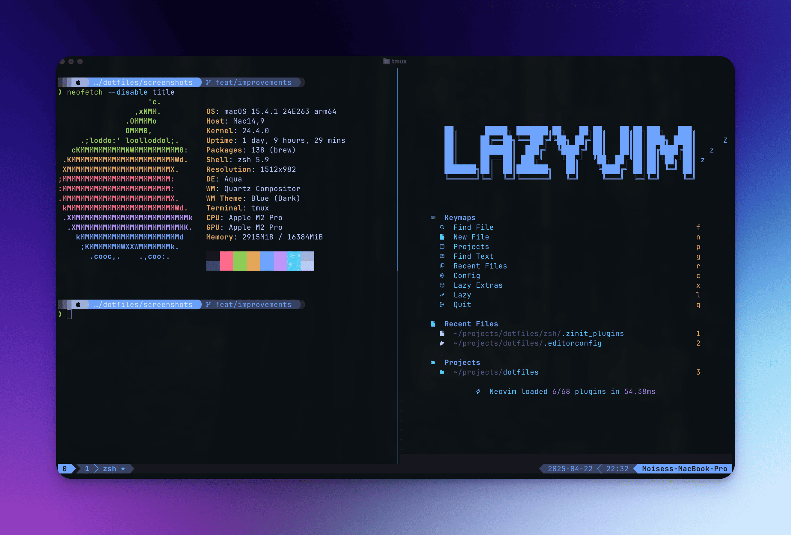

# `~/.dotfiles`

<p align="center">
  
</p>

My personal dotfiles for macOS and GitHub Codespaces environments.

## ✨ Features

- 🔄 Cross-platform setup (macOS & GitHub Codespaces)
- 🧪 GitHub Actions for automated testing
- 🔧 Easy installation with environment detection
- 🛠️ Modular configuration with GNU Stow

## 🛠️ Tools & Configurations

### 🐚 ZSH

- Custom `.zshrc` configuration
- Various useful aliases and functions
- Integration with tools like `fzf`, `ripgrep`, and more

### 🔮 Neovim

- Full-featured development environment
- LSP integration with autocompletion
- Syntax highlighting and treesitter support
- Snacks for fuzzy finding
- Custom keybindings and plugins
- AI integration with Avante and CodeCompanion
- Cursor like features

### 📊 Tmux

- Custom key bindings
- Status bar customization
- Session management
- Integration with tmux plugins via TPM

### 👻 Ghostty

- Modern terminal emulator configuration
- Custom color schemes and fonts
- Performance optimizations

### 🚀 Starship

- Cross-shell customizable prompt
- Git status integration
- Runtime information

### 🍺 Homebrew

- Package management for macOS
- Customized Brewfile with essential software
- Automated installation of development tools

### 📊 SketchyBar

- Highly customizable macOS menu bar replacement
- Custom status bar with system information
- Tokyo Night inspired color scheme
- Displays: workspace switcher, front app, time, volume, battery, WiFi, and CPU usage
- Plugin-based architecture for easy customization

### 🐳 Docker & Lazydocker

- Custom Docker configuration
- Lazydocker for container management
- Integration with Colima for macOS

### 🗂️ Lazygit

- Terminal UI for Git commands
- Custom keybindings and themes
- Seamless Git workflow

### 🔄 Mise

- Runtime version manager
- Configuration for multiple languages
- Automatic version switching

## 📥 Installation

### macOS

```bash
# Clone the repository
git clone https://github.com/moisesmorillo/dotfiles.git ~/.dotfiles
cd ~/.dotfiles

# Run the install script
chmod +x install.sh
./install.sh
```

### GitHub Codespaces

The dotfiles will be automatically installed when creating a new Codespace.

## 🧪 Testing

This repository includes GitHub Actions workflows to test the configuration:

- Shell script linting with ShellCheck
- YAML validation
- Cross-platform installation tests
- Lua type checking for Neovim configuration

## 📂 Structure

```
.
├── zsh/          # ZSH configuration
├── nvim/         # Neovim configuration
├── tmux/         # Tmux configuration
├── brew/         # Homebrew bundle files
├── ghostty/      # Ghostty terminal config
├── starship/     # Starship prompt config
├── sketchybar/   # SketchyBar menu bar config
├── docker/       # Docker configuration
├── lazygit/      # Lazygit configuration
├── lazydocker/   # Lazydocker configuration
├── mise/         # Mise runtime manager config
└── scripts/      # Installation scripts
```

## ⚖️ License

MIT 